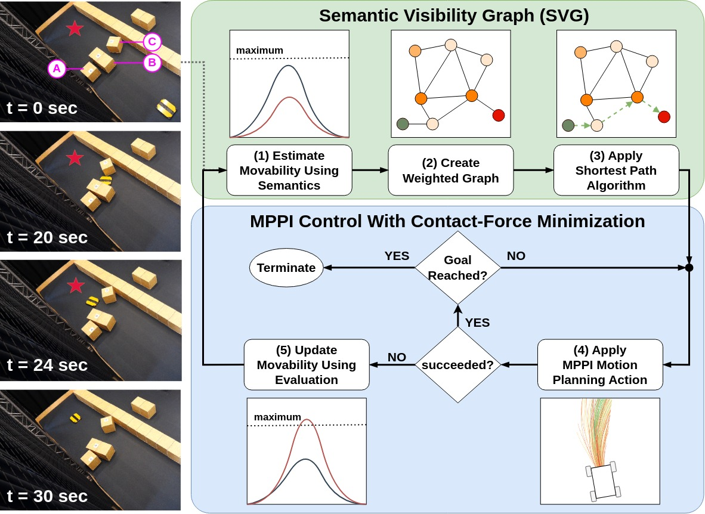
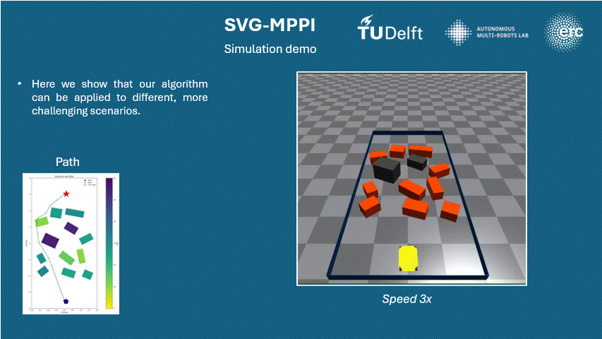

# Pushing Through Clutter With Movability Awareness of Blocking Obstacles
Accepted to the International Conference on Robotics and Automation (ICRA) 2025
[Check out our video!](https://www.youtube.com/watch?v=oePiRNrdl4Q)

## Abstract
Navigation Among Movable Obstacles (NAMO) poses a challenge for traditional path-planning methods when obstacles block the path, requiring push actions to reach the goal. We propose a framework that enables movability-aware planning to overcome this challenge without relying on explicit obstacle placement. Our framework integrates a global Semantic Visibility Graph and a local Model Predictive Path Integral (SVG-MPPI) approach to efficiently sample rollouts, taking into account the continuous range of obstacle movability. A physics engine is adopted to simulate the interaction result of the rollouts with the environment, and generate trajectories that minimize contact force. In qualitative and quantitative experiments, SVG-MPPI outperforms the existing paradigm that uses only binary movability for planning, achieving higher success rates with reduced cumulative contact forces.

## Overview


An overview of the proposed SVG-MPPI architecture where the SVG provides a weighted graph with efficient node placement around movable obstacles along which a lowest-effort path can be found. The generated set of waypoints guides the MPPI control strategy to efficiently sample rollouts around movable obstacles. If during interaction an obstacle is considered non-movable, the movability estimation gets updated and the path is replanned. Snapshots of a real-world example are shown on the left where the red star indicates the goal location and the masses of the obstacles are (A): 25 kg, (B): 20 kg, (C): 5 kg.

## Example



## Installation
To get the project up and running, follow the steps below:

1. **Set Interpreter to Poetry Environment**:
    - Ensure that your Python interpreter is correctly set to the Poetry virtual environment. If you haven't set up Poetry, install it by following [Poetry's documentation](https://python-poetry.org/docs/).
    - Run the following command to activate the Poetry environment for this project:
      ```bash
      poetry install
      ```
    - Confirm that Poetry is using the correct environment by checking the executable path:
      ```bash
      poetry env info --executable
      ```

2. **Download and Install Isaac Gym**:
    - The project relies on Isaac Gym for its physics simulation capabilities. You need to download Isaac Gym from [NVIDIA's website](https://developer.nvidia.com/isaac-gym).
    - Once downloaded, place the `isaacgym` folder inside the `src` directory of the project:
      ```
      project-root/
      ├── src/
      │   └── isaacgym/
      ```
    - Follow the installation instructions provided by NVIDIA to ensure Isaac Gym is correctly set up in your environment.

3. **Update Git Submodules**:
    - The project might include external dependencies managed as Git submodules. Make sure all submodules are updated by running the following commands:
      ```bash
      git submodule init
      git submodule update --recursive --remote
      ```
    - If new submodules have been added, this ensures they are properly fetched and integrated into the project.

4. **Build the Project**:
    - Once the environment and dependencies are ready, build the project. Navigate to the project’s root directory and run:
      ```bash
      poetry run build
      ```
    - This command will ensure that all necessary components are compiled and ready for use.

5. **Set Up ROS**:
    - If your project interacts with ROS (Robot Operating System), make sure to source the correct ROS environment. Run the following command to source the environment based on your ROS distribution (e.g., `melodic`, `noetic`):
      ```bash
      source /opt/ros/<ros_distro>/setup.bash
      ```
    - Make sure your ROS workspace is also built and sourced before running the project:
      ```bash
      catkin_make
      source devel/setup.bash
      ```

6. **Verify Installation**:
    - Test the installation by running one of the provided examples or demos to ensure all components are functioning as expected. If any issues arise, check the logs or error messages for more information.


### Troubleshooting
- To check the environment executable path, use:
  ```bash
  poetry env info --executable
  ```
- If running out of space, clear poetry cache:
  ```bash
    poetry cache clear --all .
  ```


